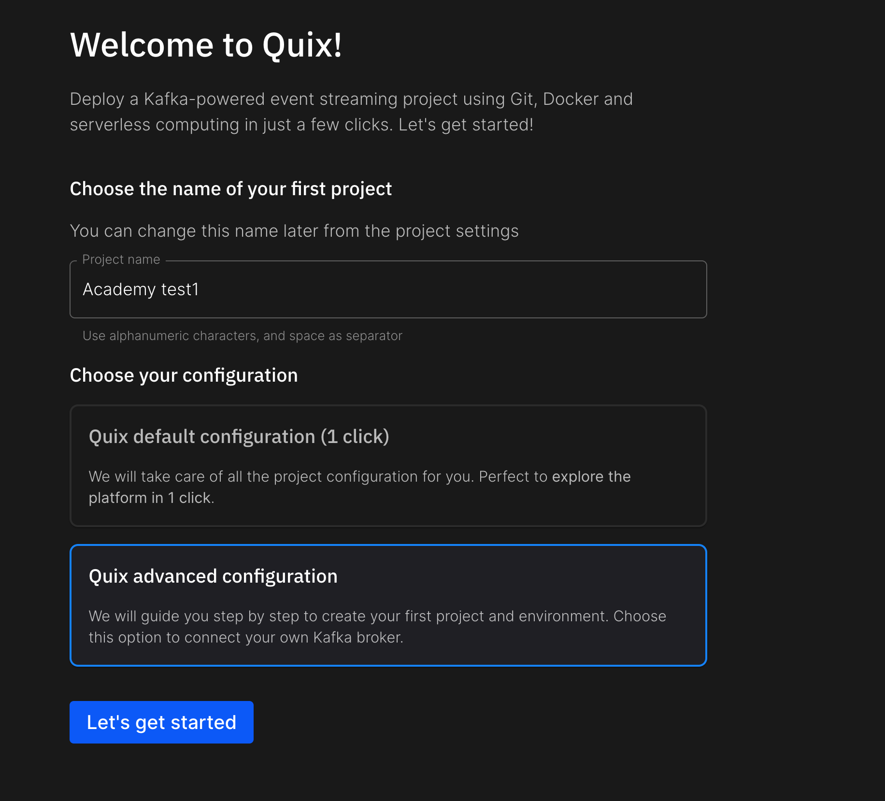
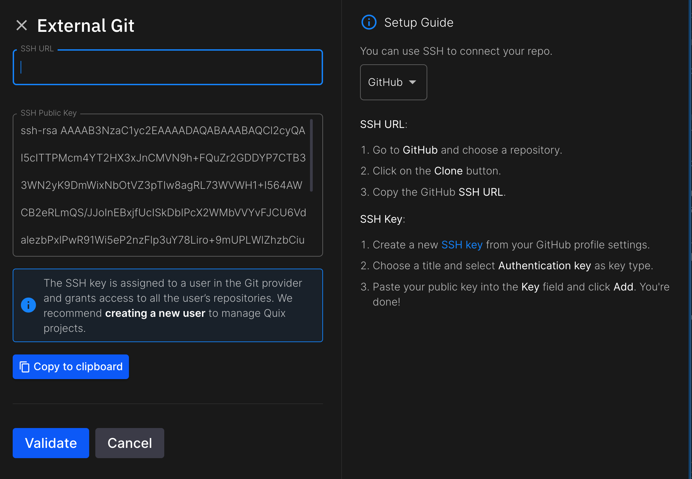

# Streaming Academy
This repo contains a code and instructions to support series of episodes of Streaming Academy. This series goal is to teach Data engineers and Software Engineers how to build and develop redistributed fault-tolerant streaming architectures using Kafka and Python. 

## Curriculum
1. Episode 1: Intro to stream processing
   - What is stream processing
   - Motivation
   - Landscape overview
   - Kafka fundamentals
     - Topics
     - Partitions
     - Consumer groups
     - Checkpointing
   - Quix Streams fundamentals
     - Application
     - DataFrame
     - Produce message
     - Creating transformation
     - Output DataFrame
     - Reprocessing
   - Practice part
     - Sign up
     - Create a project
     - Create an environment
     - Setting up GitHub codespaces
     - Creating Flask WebGateway producer
     - Building data normalization service
2. Episode 2: Stateful data transformations
   - Usecases
   - State fundamentals
   - Basic state operations
   - Windows
   - State recovery
   - Partition reaasigment
   - Changelog topics
   - Group By (repartition)
3. Episode 3: Application development
   - Common ways to integrate stream processing pipelines with end apps
   - WebAPI ingestion
   - WebSocket ingestion
   - WebSocket consumption
   - In-memory views
   - Consumer lag metrics
4. Episode 4: Realtime ML inference
   - Architecture introduction
   - Model training
   - Model deployment
   - Model KPIs
   - A/B testing

# Episode 1


## Create new repo in GitHub
Create new empty repository for your project in GitHub. 

You should end up on empty project screen like this:


## Sign up and create new project in Quix
This step is optional, and you can develop whole pipeline locally but we recommend to use QuixCloud trial for your first project so you don't have to spent time on local infrastructure installation (Kafka or Docker).

1. Sign up here: https://quix.io/signup
2. Specify `project name` and select **Quix advanced configuration**
   
   

3. Select **Connect your own Git repo**
   - Copy **SSH URL** from your new GitHub repo
   - Press **Copy to clipboard** button
   - Follow instruction on the right to add your **SSH key**

   

4. Create main branch and future prod environment
5. Finish tutorial by clicking next until project is created.

### Create dev environment
1. In QuixCloud, add **New environement**
2. Name it Episode1
3. Create new branch based on main called `ep1`
4. Click next until done


## Select your IDE
You can develop locally, or use any of managed online IDEs. For this tutorial we recommend using GitHub codespaces. 

### Create new GitHub CodeSpace
Go to your GitHub repo homepage and click code:


### Install extensions handy for the project
- ms-python.python
- ms-python.vscode-pylance
- ms-python.debugpy

### Checkout dev branch
```git
git fetch
git checkout ep1
```

## Install Quix CLI
Quix CLI helps you to connect to your cloud infrastructure seamlessly as well as helps you with managing your pipeline locally. 

### Installation of Quix CLI

To install the Quix CLI, users have multiple methods depending on their operating system. Here's an expanded installation section including the main ways to install Quix CLI on Linux, macOS, and Windows.

#### For macOS:

- **Install latest version:**

  ```bash
  curl -fsSL https://github.com/quixio/quix-cli/raw/main/install.sh | sudo bash
  ```

#### For Linux:

- **Install latest version:**

    ```bash
    curl -fsSL https://github.com/quixio/quix-cli/raw/main/install.sh | sudo bash
    ```

#### For Windows (PowerShell):

- **Install latest version:**

  ```powershell
  iwr https://github.com/quixio/quix-cli/raw/main/install.ps1 -useb | iex
  ```

### Login
Pair your local CLI context with your Cloud account:
```
quix login
```

## Python VENV
Let's start with creating virtual environment for Python

```
python3 -m venv venv
source venv/bin/activate
```

## Let's start with demo data source
To simulate data source before we connect to real one, let's replay sample file with messages.  

### Create new service from template
```
quix local apps create demo-data-source -p raw-replay
cd raw-replay/
```
Then download sample data file: 
```
wget https://raw.githubusercontent.com/tomas-quix/streaming-academy/main/file-sink/demo_stream.json
```

### Edit service settings and code

In order to set up our development environment with QuixCloud, we need to set local context to one of our environment. Run:
```
quix use
```

and select our project we have created and `Episode1` environmnent. 

Then edit app.yaml variables to configure output topic to send data to `raw-data`:

```yaml
name: RAW data replay
language: python
variables:
  - name: output
    inputType: OutputTopic
    description: Name of the output topic to write into
    defaultValue: raw-data
    required: true
dockerfile: dockerfile
runEntryPoint: main.py
defaultFile: main.py
```
then we create local `.env` file to inject environment variables into the runtime using:
```
quix local vars export
```

This will create `.env` file:
```
Quix__Portal__Api=https://portal-api.platform.quix.io
Quix__Organisation__Id=tomas
Quix__Workspace__Id=tomas-academytest1-episode1
Quix__Sdk__Token=sdk-17a8da224d2e481886********
output=raw-data

```

These environment variables are then injected into the runtime because of these lines at the top of the `main.py`:

```python
from dotenv import load_dotenv
load_dotenv()
```
### pip install
Install service Python dependencies specified in `requirements.txt`:
```
pip install -r requirements.txt 
```

change main.py to send data from `demo_stream.json` that we donwloaded with wget command couple of steps above:

```python
from quixstreams import Application
import json
import time
import os

# import the dotenv module to load environment variables from a file
from dotenv import load_dotenv
load_dotenv(override=False)

# Create an Application.
app = Application.Quix()

# Define the topic using the "output" environment variable
topic_name = os.getenv("output", "")
if topic_name == "":
    raise ValueError("The 'output' environment variable is required. This is the output topic that data will be published to.")

topic = app.topic(topic_name)

with app.get_producer() as producer:
    with open("demo_stream.json", 'r') as file:
        for line in file:
            # Remove newline characters from the message
            message = json.loads(line.strip())
            
            # Publish message to Kafka
            producer.produce(topic.name, json.dumps(message), "demo_stream.json")

            print(message)
            time.sleep(1)

    producer.flush(30)  # Wait for all messages to be delivered
    print('All messages have been flushed to the Kafka topic')
```

### Running replay
Now last step is to run replay service and produce some sample data into `raw-data` topic so we can continue building our pipeline:

```
python3 main.py
```

### Inspecting data
Go to topics tab in project to inspect data being send to topic:


## Creating Data normalization service
Now we have sucesfully created ingestion pipeline for our data, we can proccess them. 

> [!NOTE]
> Later we will replace Replay service with real data producer, a Flask Web API gateway ingesting real data from phones. 

Let's start with creating new service from `starter-transformation` template:
```
cd ..
quix local apps create starter-transformation -p data-normalization
cd data-normalization
pip install -r requirements.txt
```

Open main.py and edit app definition to adjust our app for development. We change following code:
1. Change consumer group to randonmly generated so every time we run our code, we recieve data from the beggining of topic and input records are predictable. We need to put stable string back when we deploy this to production.
2. We disable changelog topics as we need to polute Kafka with dev changelog topics.
3. Comment out output topic defition
4. Comment out output until we have output data in shape

```python
app = Application.Quix(
    str(uuid.uuid4()),
    auto_offset_reset="earliest",
    use_changelog_topics=False)

input_topic = app.topic(os.environ["input"])
#output_topic = app.topic(os.environ["output"])

```

and at the end of file:

```
#sdf = sdf.to_topic(output_topic)
```

### Local environment preparation
In order to run your code against Quix Cloud infrastructure, we must sync our local environment again with Quix Cloud.

Now lets go to app.yaml and change input and output topics as following:

```yaml
name: data-normalization
language: Python
variables:
  - name: input
    inputType: InputTopic
    description: Name of the input topic to listen to.
    defaultValue: raw-data
    required: true
  - name: output
    inputType: OutputTopic
    description: Name of the output topic to write to.
    defaultValue: table-data
    required: true
dockerfile: dockerfile
runEntryPoint: main.py
defaultFile: main.py
```

then we create local `.env` file to inject environment variables into the runtime:
```
quix local vars export
```

### Data normalization

We are left with rest of `main.py` as following:

```python
sdf = app.dataframe(input_topic)

# Here we are going to add our logic

sdf = sdf.update(lambda row: print(row))

if __name__ == "__main__":
    app.run(sdf)
```

If we run service now, it will print messages into console:
```
python3 main.py
```
<details>

<summary>Example of conssole output</summary>

```
[2024-05-13 12:44:58,714] [INFO] : Starting the Application with the config: broker_address="kafka-k1.quix.io:9093,kafka-k2.quix.io:9093,kafka-k3.quix.io:9093" consumer_group="tomas-academytest1-episode1-addf57c7-37eb-4cdb-9245-b1645c488fa0" auto_offset_reset="earliest"
[2024-05-13 12:44:58,715] [INFO] : Topics required for this application: "tomas-academytest1-episode1-raw-data"
[2024-05-13 12:44:58,715] [INFO] : Attempting to create topics...
[2024-05-13 12:44:58,739] [INFO] : No topic creations required!
[2024-05-13 12:44:58,739] [INFO] : Validating Kafka topics exist and are configured correctly...
[2024-05-13 12:44:59,043] [INFO] : Kafka topics validation complete
[2024-05-13 12:44:59,043] [INFO] : Initializing state directory at "/workspaces/streaming-academy-test1/data-normalization/state/tomas-academytest1-episode1-addf57c7-37eb-4cdb-9245-b1645c488fa0"
[2024-05-13 12:44:59,044] [INFO] : Waiting for incoming messages
{'messageId': 10992, 'sessionId': 'f562d95c-4ab4-4843-8d55-cb6f6e559594', 'deviceId': '15f99ef1-5dc0-46c5-ae41-ef4a99d58734', 'payload': [{'name': 'accelerometer', 'time': 1715254448336798500, 'values': {'z': 0.03500760049521923, 'y': 0.010823591831326484, 'x': -0.04537117359936237}}, {'name': 'accelerometeruncalibrated', 'time': 1715254448340549400, 'values': {'z': -0.61737060546875, 'y': -0.677886962890625, 'x': -0.3983306884765625}}, {'name': 'accelerometer', 'time': 1715254448386809600, 'values': {'z': -0.026910218757390976, 'y': 0.03680851243734359, 'x': -0.0001911386579275131}}]}
```
</details>
That is a bit hard to read. Let's improve message formating by adding JSON indent:
```python
import json
sdf = sdf.update(lambda row: print(json.dumps(row, indent=4)))
```

Running code again, we can now read messages clearly. As you can see in the example message, multiple sensors and multiple timestamps are included in one message from 

```json
{
  "messageId": 10994,
  "sessionId": "f562d95c-4ab4-4843-8d55-cb6f6e559594",
  "deviceId": "15f99ef1-5dc0-46c5-ae41-ef4a99d58734",
  "payload": [
    {
      "name": "accelerometer",
      "time": 1715254448786894800,
      "values": {
        "z": 0.4370160372585058,
        "y": -0.3171194917678833,
        "x": -0.3749550101429224
      }
    },
    {
      "name": "accelerometeruncalibrated",
      "time": 1715254448790645800,
      "values": {
        "z": -0.60107421875,
        "y": -0.68988037109375,
        "x": -0.382659912109375
      }
    },
    {
      "name": "accelerometer",
      "time": 1715254448836904700,
      "values": {
        "z": -0.5078478153288364,
        "y": -0.8010843272060155,
        "x": 1.3548703023672104
      }
    }
  ]
}
```

We don't need payload metadata envelope for now, so we extract payload:

```python
sdf = app.dataframe(input_topic)

sdf = sdf.apply(lambda row: row["payload"], expand=True)

sdf = sdf.update(lambda row: print(json.dumps(row, indent=4)))
```

`apply` method with take incoming message and convert it to something else. First predicate will be called for each incomming message. Setting `expand` to `True` will flatten messages containing multiple records to one level:

```json
{
    "name": "accelerometer",
    "time": 1715254446586427000,
    "values": {
        "z": -0.0675555328786373,
        "y": 0.00914718305170536,
        "x": -0.04088555261790752
    }
}
{
    "name": "battery",
    "time": 1715254446599000000,
    "values": {
        "batteryLevel": 0.75,
        "batteryState": "unplugged",
        "lowPowerMode": "False"
    }
}
{
    "name": "accelerometeruncalibrated",
    "time": 1715254446640188000,
    "values": {
        "z": -0.6206207275390625,
        "y": -0.6722259521484375,
        "x": -0.387420654296875
    }
}
```

Now is a time to convert nested JSON to streaming table. 

```python
def transpose(row: dict):

    result = {
        "time": row["time"]
    }

    for key in row["values"]:
        result[row["name"] + "-" + key] = row["values"][key]

    return result
        
sdf = sdf.apply(transpose)
```

Here we join name of the sensor and its dimension to one string that defines column in output table. As a result, we get this output:

```
{
    "time": 1715254449140719600,
    "accelerometeruncalibrated-z": -0.8031158447265625,
    "accelerometeruncalibrated-y": -0.7025299072265625,
    "accelerometeruncalibrated-x": 0.11285400390625
}
{
    "time": 1715254449186978800,
    "accelerometer-z": -0.7760480856269597,
    "accelerometer-y": 0.022184943801164626,
    "accelerometer-x": -0.2300181131537072
}
{
    "time": 1715254449190730800,
    "accelerometeruncalibrated-z": -0.807373046875,
    "accelerometeruncalibrated-y": -0.679962158203125,
    "accelerometeruncalibrated-x": 0.0048980712890625
}
```

That is almost there, let's disable JSON formatting and print it as table:

```python
sdf = sdf.update(lambda row: print(list(row.values())))
```

this will result in console output like this:

```
[1715254448786894800, 0.4370160372585058, -0.3171194917678833, -0.3749550101429224]
[1715254448790645800, -0.60107421875, -0.68988037109375, -0.382659912109375]
[1715254448836904700, -0.5078478153288364, -0.8010843272060155, 1.3548703023672104]
[1715254448840656000, -0.7664794921875, -0.7050628662109375, -0.144500732421875]
[1715254448886915600, -0.07118775190114975, 0.7032201653033494, 0.42249665964916344]
[1715254448890666800, -0.8001556396484375, -0.517425537109375, -0.108062744140625]
[1715254448936925700, 0.33777298821806906, -0.5094838920980692, -1.1883429386049509]
[1715254448940677600, -0.802093505859375, -0.6744384765625, -0.1807708740234375]
[1715254448986936800, -1.3308470372229815, 0.024103929165005682, -1.2672994248114526]
[1715254448990687700, -0.9002838134765625, -0.64801025390625, -0.17950439453125]
[1715254449036947700, 0.8130968365609645, 1.4198895947664976, -0.31100747516099364]
[1715254449040699000, -0.59027099609375, -0.563751220703125, -0.0431976318359375]
[1715254449086957600, 1.587524627509713, 0.2660755332291126, 0.7324434833087027]
[1715254449007135000, 247.4679606668651, 0.30848966493495394, -1, 50.113308514642924, 203.781837772578, -1, 4.736579546382497, 3.374811288587825, 14.38960443938865, 0]
[1715254449090708700, -0.56170654296875, -0.6567840576171875, 0.1042022705078125]
[1715254449136969000, -0.45388358542919155, 0.13930676388144492, 0.7338478702139108]
[1715254449140719600, -0.8031158447265625, -0.7025299072265625, 0.11285400390625]
[1715254449186978800, -0.7760480856269597, 0.022184943801164626, -0.2300181131537072]
[1715254449190730800, -0.807373046875, -0.679962158203125, 0.0048980712890625]
```

### Data filtering
Now as you can see, there are different columns between messages. That is because phone was sending accelerometer data as well as GPS data. This is not good for any downstream service. We can normalise data using hopping/rolling windwos but that is content of next episode because it requires state. For now lets just filter rows where we have GPS data and select only columns we are interested in:

```python
sdf = sdf[sdf.contains("location-latitude")]
sdf = sdf[["time", "location-altitude", 'location-latitude', "location-longitude"]]
```

will output:

```
[1715254429007296800, 249.547044695355, 50.11330628600489, 14.389511598367001]
[1715254430007288600, 249.547044695355, 50.11330628600489, 14.389511598367001]
[1715254431007280400, 249.547044695355, 50.11330628600489, 14.389511598367001]
[1715254432007272400, 249.93117337021977, 50.113305175405735, 14.389472588322521]
[1715254433007264800, 249.81628067232668, 50.11330528153415, 14.38946596160171]
[1715254434007256000, 249.77402337826788, 50.11330312571102, 14.389482195950036]
[1715254435007248400, 249.59627519268543, 50.11331077794926, 14.389512011611155]
[1715254436007240000, 249.30241688899696, 50.113301329252025, 14.389593818244501]
[1715254437007232300, 248.96997749153525, 50.11330960107871, 14.389572275947511]
[1715254438007224000, 248.96997749153525, 50.11330960107871, 14.389572275947511]
[1715254439007216400, 248.96997749153525, 50.11330960107871, 14.389572275947511]
[1715254440007208000, 247.22055699117482, 50.11330768635292, 14.389610212961449]
[1715254441007199700, 247.4679606668651, 50.113308514642924, 14.38960443938865]
[1715254442007192000, 247.4679606668651, 50.113308514642924, 14.38960443938865]
[1715254443007184100, 247.4679606668651, 50.113308514642924, 14.38960443938865]
[1715254444007175400, 247.4679606668651, 50.113308514642924, 14.38960443938865]
[1715254445007167200, 247.4679606668651, 50.113308514642924, 14.38960443938865]
[1715254446007159600, 247.4679606668651, 50.113308514642924, 14.38960443938865]
[1715254447007151000, 247.4679606668651, 50.113308514642924, 14.38960443938865]
[1715254448007143400, 247.4679606668651, 50.113308514642924, 14.38960443938865]
[1715254449007135000, 247.4679606668651, 50.113308514642924, 14.38960443938865]
```