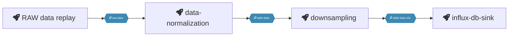

```mermaid
%%{ init: { 'flowchart': { 'curve': 'monotoneX' } } }%%
graph LR;
table-data{{ fa:fa-arrow-right-arrow-left table-data &#8205}}:::topic --> downsampling[fa:fa-rocket downsampling &#8205];
downsampling[fa:fa-rocket downsampling &#8205] --> table-data-10s{{ fa:fa-arrow-right-arrow-left table-data-10s &#8205}}:::topic;
raw-data{{ fa:fa-arrow-right-arrow-left raw-data &#8205}}:::topic --> data-normalization[fa:fa-rocket data-normalization &#8205];
data-normalization[fa:fa-rocket data-normalization &#8205] --> table-data{{ fa:fa-arrow-right-arrow-left table-data &#8205}}:::topic;
RAW_data_replay[fa:fa-rocket RAW data replay &#8205] --> raw-data{{ fa:fa-arrow-right-arrow-left raw-data &#8205}}:::topic;
table-data-10s{{ fa:fa-arrow-right-arrow-left table-data-10s &#8205}}:::topic --> influx-db-sink[fa:fa-rocket influx-db-sink &#8205];


classDef default font-size:110%;
classDef topic font-size:80%;
classDef topic fill:#3E89B3;
classDef topic stroke:#3E89B3;
classDef topic color:white;
```